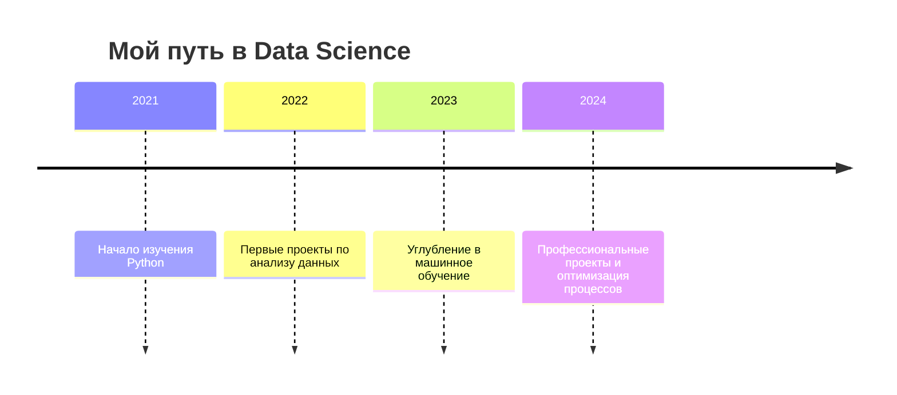

# 🌟 Добро пожаловать в мой цифровой архив!

## 📬 Связаться со мной

  
  
  

---

## 👋 Привет! Я Александр

> 📊 **Data Scientist** | 🐍 Python разработчик | 🎯 Аналитик данных | 🌱 Постоянно учусь

Я создаю **осмысленные данные из хаоса**, превращая сырые числа в **понятные бизнес-решения**.  
Моя миссия — сделать анализ данных **доступным, понятным и полезным** для всех.

  
  

---

## 🧠 Мой технологический стек

  
  
  
  
  
  
  
  

---

## 🚀 Избранные проекты

### 🔍 [Анализ рынка квартир](https://github.com/ASh-Archives/data_science/blob/main/html_view/03_research_apartments.html)
> Исследование объявлений о продаже квартир: выявление аномалий, оценка рыночной стоимости, поиск ключевых факторов влияющих на цену.

### 📈 [Прогнозирование заказов такси](https://github.com/ASh-Archives/data_science/blob/main/html_view/33_taxi_order_forecasting.html)
> Прогноз количества заказов на следующий час для оптимизации числа водителей в пиковые часы.

### 👁️ [Компьютерное зрение: Определение возраста](https://github.com/ASh-Archives/data_science/blob/main/html_view/42_cv_project.html)
> Модель определения возраста по фотографии лица с использованием нейронных сетей.

### 💼 [HR Analytics: Удержание сотрудников](https://github.com/ASh-Archives/data_science/blob/main/html_view/23_hr_analytics.html)
> Анализ факторов, влияющих на увольнение сотрудников, и разработка модели прогнозирования оттока.

  

---

## 📊 Мой путь в Data Science

---

## 🌱 Чем я дышу

| Категория | Интересы |
|-----------|----------|
| **Профессионально** | Анализ данных, машинное обучение, визуализация, оптимизация бизнес-процессов |
| **Технически** | Python, SQL, Pandas, NumPy, Matplotlib, scikit-learn, Keras |
| **Лично** | Дипломированный специалист, наставничество, открытые данные, технические блоги |
| **В планах** | Создание open-source инструментов для анализа данных, участие в хакатонах |

---

## 📜 Последние коммиты

  

---

## 💬 Цитата дня

> "В данных есть красота, которую можно увидеть только через анализ."  
> — *Александр, Data Scientist*

---

  
   
  Спасибо, что заглянули в мой цифровой архив! 🙌

---

## 🧩 Как это работает?

Этот README создан с использованием:
- [GitHub Markdown](https://docs.github.com/en/get-started/writing-on-github/getting-started-with-writing-and-formatting-on-github/basic-writing-and-formatting-syntax)
- [GitHub Readme Stats](https://github.com/anuraghazra/github-readme-stats)
- [Mermaid Live Editor](https://mermaid.live/)
- [Shields.io](https://shields.io/)
- [Typing SVG](https://readme-typing-svg.demolab.com/)

Весь код открыт и доступен на GitHub. Не стесняйтесь вносить предложения и улучшения!

---

> ✨ **P.S.** Этот профиль обновляется автоматически каждый раз, когда я пушу новые изменения.  
> Последнее обновление: `2023-10-15`

<!-- Скрытые ссылки на дипломы -->
[Диплом (ENG)](https://github.com/ASh-Archives/ASh-Archives/blob/main/Diplom_ENG_Shagrudinov.pdf)
[Диплом (RUS)](https://github.com/ASh-Archives/ASh-Archives/blob/main/Diplom_RUS_Shagrudinov.pdf)
